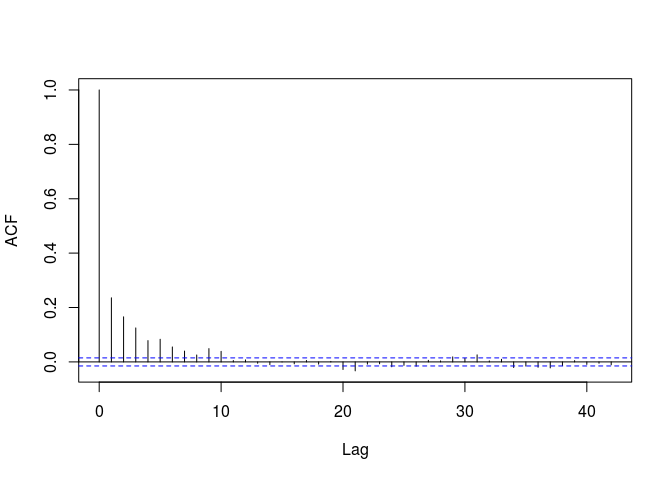
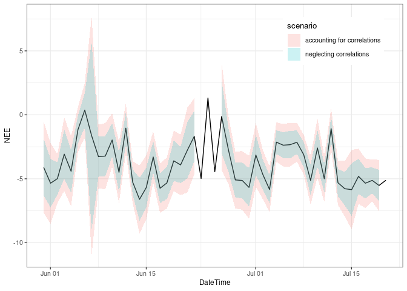

Aggregating uncertainty to daily and annual values
==================================================

Example setup
-------------

We start with half-hourly *u*\*-filtered and gap-filled
NEE\_f values. For simplicity this example uses data provided with the
package and omits *u*\* threshold detection but rather
applies a user-specified threshold.

With option `FillAll = TRUE`, an uncertainty, specifically the standard
deviation, of the flux is estimated for each record during gapfilling
and stored in variable `NEE_uStar_fsd`.

    library(REddyProc)
    library(dplyr)
    EddyDataWithPosix <- Example_DETha98 %>% 
      filterLongRuns("NEE") %>% 
      fConvertTimeToPosix('YDH',Year = 'Year',Day = 'DoY', Hour = 'Hour')
    EProc <- sEddyProc$new(
      'DE-Tha', EddyDataWithPosix, c('NEE','Rg','Tair','VPD', 'Ustar'))
    EProc$sMDSGapFillAfterUstar('NEE', uStarTh = 0.3, FillAll = TRUE)
    results <- EProc$sExportResults() 
    summary(results$NEE_uStar_fsd)

    ##     Min.  1st Qu.   Median     Mean  3rd Qu.     Max. 
    ##  0.03535  1.69960  2.32796  2.74246  3.44417 24.55782

We can inspect, how the uncertainty scales with the flux magnitude.

    plot( NEE_uStar_fsd ~ NEE_uStar_fall, slice(results, sample.int(nrow(results),400)))

Wrong aggregation without correlations
--------------------------------------

With neglecting correlations among records, the uncertainty of the mean
annual flux is computed by adding the variances. The mean is computed by
*m* = ∑*x**i*/*n*. And hence its standard deviation by
$sd(m) = \\sqrt{Var(m)}= \\sqrt{\\sum{Var(x\_i)}/n^2} = \\sqrt{n \\bar{\\sigma^2}/n^2} = \\bar{\\sigma^2}/\\sqrt{n}$.
This results in an approximate reduction of the average standard
deviation $\\bar{\\sigma^2}$ by $\\sqrt{n}$.

    results %>% filter(NEE_uStar_fqc == 0) %>% summarise(
      nRec = sum(is.finite(NEE_uStar_f))
      , varSum = sum(NEE_uStar_fsd^2, na.rm = TRUE)
      , seMean = sqrt(varSum) / nRec
      , seMeanApprox = mean(NEE_uStar_fsd, na.rma = TRUE) / sqrt(nRec)
      ) %>% select(nRec, seMean, seMeanApprox)

    ##    nRec     seMean seMeanApprox
    ## 1 10901 0.02988839   0.02650074

Due to the large number of records, the estimated uncertainty is very
low.

Considering correlations
------------------------

When observations are not independent of each other, the formulas now
become *V**a**r*(*m*)=*s*2/*n**e**f**f* where
$s^2 = \\frac{n\_{eff}}{n(n\_{eff}-1)} \\sum\_{i=1}^n \\sigma\_i^2$, and
with the number of effective observations *n**e**f**f*
decreasing with the autocorrelation among records (Bayley 1946, Zieba
2011).

The average standard deviation $\\sqrt{\\bar{\\sigma^2\_i}}$ now
approximately decreases only by about $\\sqrt{n\_{eff}}$:

$$
Var(m) = \\frac{s^2}{n\_{eff}} 
= \\frac{\\frac{n\_{eff}}{n(n\_{eff}-1)} \\sum\_{i=1}^n \\sigma\_i^2}{n\_{eff}}
= \\frac{1}{n(n\_{eff}-1)} \\sum\_{i=1}^n \\sigma\_i^2 \\\\
= \\frac{1}{n(n\_{eff}-1)} n \\bar{\\sigma^2\_i} = \\frac{\\bar{\\sigma^2\_i}}{(n\_{eff}-1)} 
$$

First we need to quantify the error terms, i.e. model-data residuals.
For all the records of good quality, we have an original measured value
`NEE_uStar_orig` and modelled value from MDS gapfilling,
`NEE_uStar_fall`. The residual of bad-quality data is set to missing.

    results <- EProc$sExportResults() %>% 
      mutate(
        resid = ifelse(NEE_uStar_fqc == 0, NEE_uStar_orig - NEE_uStar_fall, NA )
      )

Now we can inspect the the autocorrelation of the errors.

    acf(results$resid, na.action = na.pass, main = "")

The empiricical autocorrelation function shows strong positive
autocorrelation in residuals up to a lag of 10 records.

Computation of effective number of observations is provided by function
`computeEffectiveNumObs` from package `lognorm` based on the empirical
autocorrelation function for given model-data residuals.

    library(lognorm)
    autoCorr <- computeEffectiveAutoCorr(results$resid)
    nEff <- computeEffectiveNumObs(results$resid, na.rm = TRUE)
    c( nEff = nEff, nObs = sum(is.finite(results$resid)))

    ##      nEff      nObs 
    ##  3870.283 10901.000

We see that the effective number of observations is only about a third
of the number of observations.

Now we can use the formulas for the sum and the mean of correlated
normally distributed variables to compute the uncertainty of the mean.

    results %>% filter(NEE_uStar_fqc == 0) %>% summarise(
      nRec = sum(is.finite(NEE_uStar_fsd))
      , varMean = sum(NEE_uStar_fsd^2, na.rm = TRUE) / nRec / (!!nEff - 1)
      , seMean = sqrt(varMean) 
      #, seMean2 = sqrt(mean(NEE_uStar_fsd^2, na.rm = TRUE)) / sqrt(!!nEff - 1)
      , seMeanApprox = mean(NEE_uStar_fsd, na.rm = TRUE) / sqrt(!!nEff - 1)
      ) %>% select(seMean, seMeanApprox)

    ##       seMean seMeanApprox
    ## 1 0.05016727   0.04448115

Daily aggregation
-----------------

When aggregating daily respiration, the same principles hold.

However, when computing the number of effective observations, we
recommend using the empirical autocorrelation function estimated on
longer time series of residuals (`autoCorr` computed above) in
`computeEffectiveNumObs` instead of estimating them from the residuals
of each day.

    results <- results %>% mutate(
      DateTime = EddyDataWithPosix$DateTime
      , DoY = as.POSIXlt(DateTime - 15*60)$yday # midnight belongs to the previous
    )

    aggDay <- results %>% group_by(DoY) %>% 
      summarise(
        DateTime = first(DateTime)
        , nRec = sum( NEE_uStar_fqc == 0, na.rm = TRUE)
        , nEff = computeEffectiveNumObs(
           resid, effAcf = !!autoCorr, na.rm = TRUE)
        , NEE = mean(NEE_uStar_f, na.rm = TRUE)
        , sdNEE = if (nEff == 0) NA_real_ else sqrt(
          mean(NEE_uStar_fsd^2, na.rm = TRUE) / (nEff - 1)) 
        , sdNEEuncorr = if (nRec == 0) NA_real_ else sqrt(
           mean(NEE_uStar_fsd^2, na.rm = TRUE) / (nRec - 1))
      )
    aggDay

    ## # A tibble: 365 x 7
    ##      DoY DateTime             nRec  nEff      NEE  sdNEE sdNEEuncorr
    ##    <int> <dttm>              <int> <dbl>    <dbl>  <dbl>       <dbl>
    ##  1     0 1998-01-01 00:30:00    21  7.87  0.124    0.988       0.579
    ##  2     1 1998-01-02 00:30:00     7  3.66  0.00610  1.57        1.05 
    ##  3     2 1998-01-03 00:30:00     0  0     0.0484  NA          NA    
    ##  4     3 1998-01-04 00:30:00     0  0     0.303   NA          NA    
    ##  5     4 1998-01-05 00:30:00    28 10.9   0.195    0.851       0.515
    ##  6     5 1998-01-06 00:30:00    48 18.0   0.926    0.615       0.370
    ##  7     6 1998-01-07 00:30:00    48 18.0  -0.337    0.566       0.340
    ##  8     7 1998-01-08 00:30:00    46 17.2  -0.139    0.541       0.325
    ##  9     8 1998-01-09 00:30:00    45 16.8   0.614    0.482       0.289
    ## 10     9 1998-01-10 00:30:00    36 13.5   0.242    0.646       0.386
    ## # … with 355 more rows

The confidence bounds (+-1.96 stdDev) computed with accounting for
correlations in this case are about twice the ones computed with
neglecting correlations.
