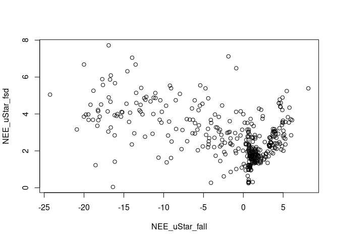

Aggregating uncertainty to daily and annual values
==================================================

Example setup
-------------

We start with half-hourly *u*\*-filtered and gap-filled
NEE\_f values. For simplicity this example uses data provided with the
package and omits *u*\* threshold detection but rather
applies a user-specified threshold.

With option `FillAll = TRUE`, an uncertainty, specifically the standard
deviation, of the flux is estimated for each record during gapfilling
and stored in variable `NEE_uStar_fsd`.

    library(REddyProc)
    library(dplyr)
    EddyDataWithPosix <- fConvertTimeToPosix(
      Example_DETha98, 'YDH',Year = 'Year',Day = 'DoY', Hour = 'Hour')
    EProc <- sEddyProc$new(
      'DE-Tha', EddyDataWithPosix, c('NEE','Rg','Tair','VPD', 'Ustar'))
    EProc$sMDSGapFillAfterUstar('NEE', uStarTh = 0.3, FillAll = TRUE)

    ## Warning in sMDSGapFill(fluxVar, QFVar = attr(qfUStar, "varnames"), QFValue
    ## = 0, : Variable NEE contains long runs of numerically equal numbers.
    ## Longest of 10 repeats of value 0.695 starts at index 1397

    results <- EProc$sExportResults() 
    summary(results$NEE_uStar_fsd)

    ##     Min.  1st Qu.   Median     Mean  3rd Qu.     Max. 
    ##  0.03535  1.69960  2.32796  2.74052  3.44417 24.55782

We can inspect, how the uncertainty scales with the flux magnitude.

    plot( NEE_uStar_fsd ~ NEE_uStar_fall, slice(results, sample.int(nrow(results),400)))

Wrong aggregation without correlations
--------------------------------------

With neglecting correlations among records, the uncertainty of the mean
annual flux is computed by adding the variances. The mean is computed by
*m* = ∑*x**i*/*n*. And hence its standard deviation by
$sd(m) = \\sqrt{Var(m)}= \\sqrt{\\sum{Var(x\_i)}/n^2}$. This results in
an aprroximate reduction of the standard deviation by $\\sqrt{n}$.

    results %>% filter(NEE_uStar_fqc == 0) %>% summarise(
      nRec = sum(is.finite(NEE_uStar_f))
      , varSum = sum(NEE_uStar_fsd^2, na.rm = TRUE)
      , seMean = sqrt(varSum) / nRec
      , seMeanApprox = mean(NEE_uStar_fsd, na.rma = TRUE) / sqrt(nRec)
      ) %>% select(nRec, seMean, seMeanApprox)

    ##    nRec     seMean seMeanApprox
    ## 1 10935 0.02979564   0.02639231

Due to the large number of records, the estimated uncertainty very low.

Considering correlations
------------------------

When observations are not independent of each other, the formulas now
become
*V**a**r*(*m*)=*V**a**r*(∑*x**i*)/*n**e**f**f* and
$\\operatorname{Var}(\\sum{x\_i}) = \\frac{n\_{eff}}{n(n\_{eff}-1)} \\sum\_{i=1}^n \\sigma\_i^2$,
with the number of effective observations *n**e**f**f*
decreasing with the autocorrelation among records (Bayley 1946, Zieba
2011).

The standard deviation now approximately decreases only by
$\\sqrt{n\_{eff}}$.

First we need to quantify the correlations and inspect their
autocorrelation.

    results <- EProc$sExportResults() %>% 
      mutate(
        resid = ifelse(NEE_uStar_fqc == 0, NEE_uStar_orig - NEE_uStar_fall, NA )
      )
    acf(results$resid, na.action = na.pass, main = "")

The empricical autocorrelation function shows strong positive
autocorrelation in residuals up to a lag of 10 records.

Computation of effective number of observations is provided by function
`computeEffectiveNumObs` from package `lognorm` based on the emprical
autocorrelation function.

    library(lognorm)
    autoCorr <- computeEffectiveAutoCorr(results$resid)
    nEff <- computeEffectiveNumObs(results$resid, na.rm = TRUE)
    c( nEff = nEff, nObs = sum(is.finite(results$resid)))

    ##      nEff      nObs 
    ##  3884.196 10935.000

    results %>% filter(NEE_uStar_fqc == 0) %>% summarise(
      nRec = sum(is.finite(NEE_uStar_fsd))
      , varMean = sum(NEE_uStar_fsd^2, na.rm = TRUE) / nRec / (!!nEff - 1)
      , seMean = sqrt(varMean) 
      , seMeanApprox = sqrt(mean(NEE_uStar_fsd^2, na.rm = TRUE)) / sqrt(!!nEff - 1)
      ) %>% select(seMean, seMeanApprox)

    ##       seMean seMeanApprox
    ## 1 0.04999971   0.04999971

Daily aggregation
-----------------

When aggregating daily respiration, the same principles hold.

However, when computing the number of effective observations, we
recommend using the empirical autocorrelation function estimated on
longer time series of residuals instead of estimating them each day.

    results <- results %>% mutate(
      DateTime = EddyDataWithPosix$DateTime
      , DoY = EddyDataWithPosix$DoY
    )

    aggDay <- results %>% group_by(DoY) %>% 
      summarise(
        DateTime = first(DateTime)
        , nRec = sum( NEE_uStar_fqc == 0, na.rm = TRUE)
        , nEff = computeEffectiveNumObs(
           resid, effAcf = !!autoCorr, na.rm = TRUE)
        , NEE = mean(NEE_uStar_f, na.rm = TRUE)
        , sdNEE = if (nEff == 0) NA_real_ else sqrt(
          mean(NEE_uStar_fsd^2, na.rm = TRUE) / (nEff - 1)) 
        , sdNEEuncorr = if (nRec == 0) NA_real_ else sqrt(
           mean(NEE_uStar_fsd^2, na.rm = TRUE) / (nRec - 1))
      )
    aggDay

    ## # A tibble: 366 x 7
    ##      DoY DateTime             nRec  nEff      NEE  sdNEE sdNEEuncorr
    ##    <int> <dttm>              <int> <dbl>    <dbl>  <dbl>       <dbl>
    ##  1     1 1998-01-01 00:30:00    21  7.87  0.102    0.987       0.578
    ##  2     2 1998-01-02 00:00:00     7  3.66  0.00269  1.58        1.05 
    ##  3     3 1998-01-03 00:00:00     0  0.    0.0484  NA          NA    
    ##  4     4 1998-01-04 00:00:00     0  0.    0.306   NA          NA    
    ##  5     5 1998-01-05 00:00:00    27 10.5   0.0958   0.867       0.525
    ##  6     6 1998-01-06 00:00:00    48 18.0   1.04     0.617       0.370
    ##  7     7 1998-01-07 00:00:00    48 18.0  -0.354    0.563       0.339
    ##  8     8 1998-01-08 00:00:00    46 17.2  -0.160    0.545       0.327
    ##  9     9 1998-01-09 00:00:00    45 16.8   0.615    0.482       0.289
    ## 10    10 1998-01-10 00:00:00    37 13.9   0.268    0.637       0.381
    ## # ... with 356 more rows

The confidence bounds computed with accounting for correlations in this
case are about the twice the ones computed with neglecting correlations.
